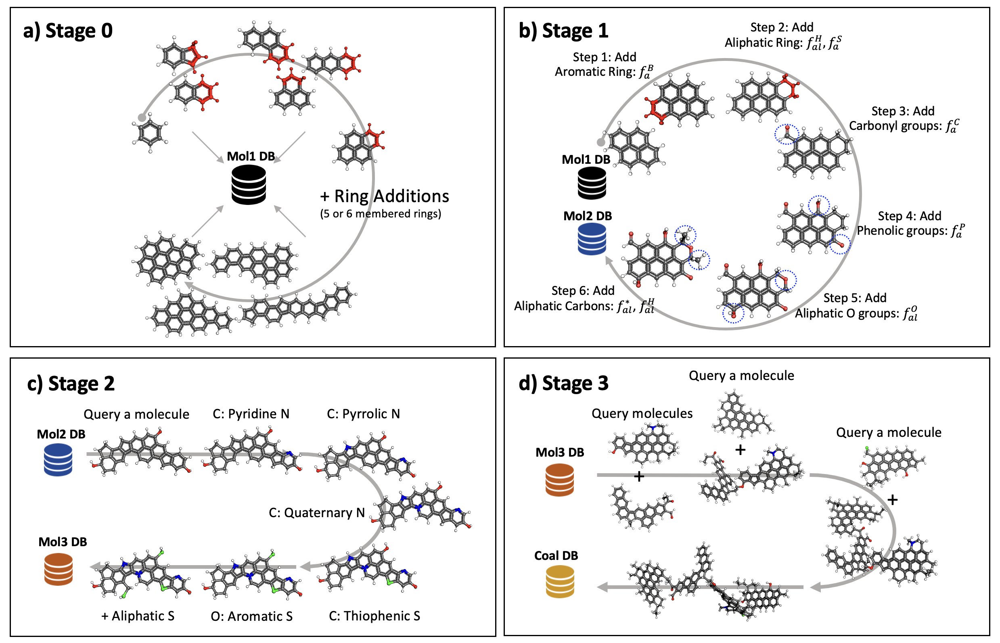
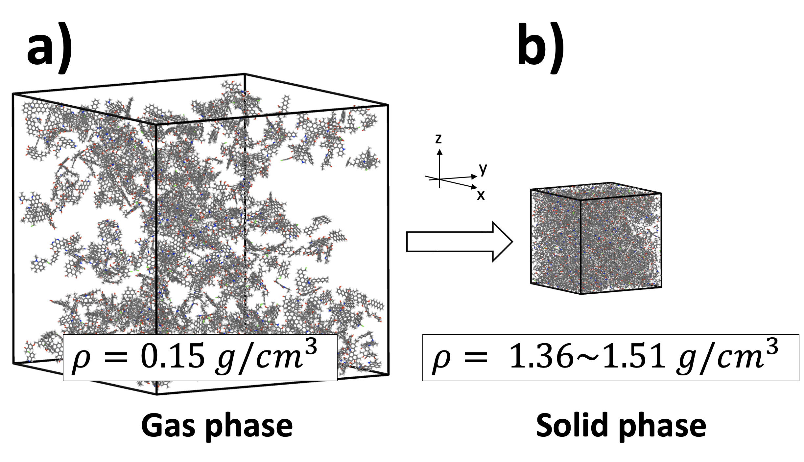

# Molecular Solid Builder

This package offers functions and workflows for constructing molecules of varying sizes, predominantly composed of hydrocarbons. It leverages the functionality of RDKit and PyMOL to efficiently construct possible molecules.

## Introduction

Complex organic compounds such as Coal, Coal derived pitch, petroluem derived pitch are often not suitable to study with the single representative molecular model because the average representation from experimental characterizations can tarnish the details of compounds which are collection of various molecular types and properties. To build realistic atomistic and molecular models, we need to accept the fact that these compounds are composed of wide range of molecular types and molecular weights.

The Molecular Solid Builder tool is an open source code utilizing python API of RDKit for molecular construction, editing and visualization. This code is composed of functions allowing to conveniently construct stochastic molecular systems such as Coal and Pitch systems together with experimental charactierzations such as TEM lattice fringe analysis, carbon-13 NMR, elemental composition analysis, and mass weight distributions, etc.



Fig1. Molecular generations based on TEM, 13C NMR, elemental composition and mass weight distribution from individual molecules.


Fig2. Solidication of multiple molecules for Coal model construction using molecular dynamics simulations.

## Installation
** Please note that the package currently can be installed from the source

```bash
git clone --depth 1 https://github.com/MoleCraftHUB/MolecularSolidBuilder.git 
cd MolecularSolidBuilder
pip install .
```

